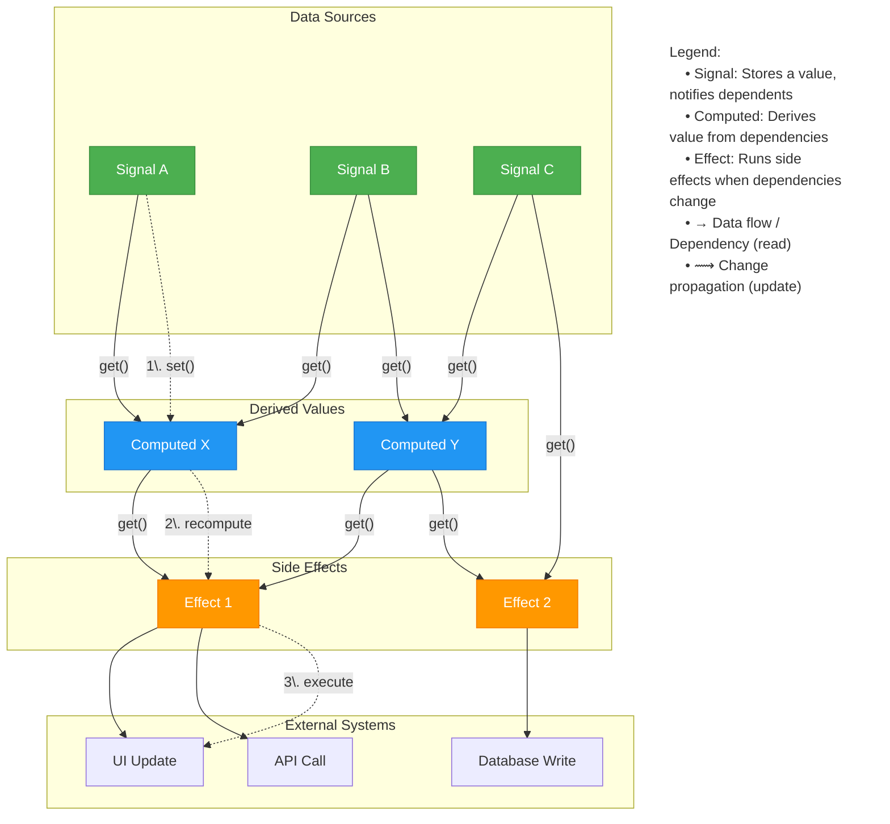
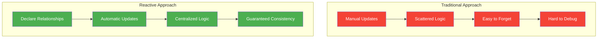
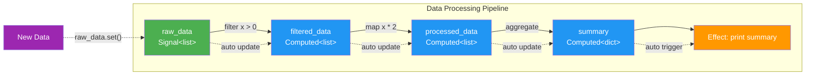

# reaktiv

 [](https://pypi.org/project/reaktiv/)    [](https://microsoft.github.io/pyright/)

**Declarative State Management for Python** - automatic dependency tracking and updates for your application state.


## Installation

```bash
pip install reaktiv
# or with uv
uv pip install reaktiv
```

`reaktiv` lets you **declare relationships between your data** instead of manually managing updates. When data changes, everything that depends on it updates automatically - eliminating a whole class of bugs where you forget to update dependent state.

**Key benefits:**
- 🐛 **Fewer bugs**: No more forgotten state updates or inconsistent data
- 📋 **Clearer code**: State relationships are explicit and centralized
- ⚡ **Better performance**: Only recalculates what actually changed
- 🔄 **Automatic updates**: Dependencies are tracked and updated automatically
- 🎯 **Python-native**: Built for Python's patterns with full async support
- 🔒 **Type safe**: Full type hint support with automatic inference

## Documentation

Full documentation is available at [https://reaktiv.readthedocs.io/](https://reaktiv.readthedocs.io/).

For a comprehensive guide, check out [The Missing Manual for Signals: State Management for Python Developers](https://bui.app/the-missing-manual-for-signals-state-management-for-python-developers/).

## Quick Start

```python
from reaktiv import Signal, Computed, Effect

# Your base data
name = Signal("Alice")
age = Signal(30)

# Derived data - automatically stays in sync
greeting = Computed(lambda: f"Hello, {name()}! You are {age()} years old.")

# Side effects - automatically run when data changes
# IMPORTANT: Must assign to variable to prevent garbage collection
greeting_effect = Effect(lambda: print(f"Updated: {greeting()}"))

# Just change your base data - everything else updates automatically
name.set("Bob")  # Prints: "Updated: Hello, Bob! You are 30 years old."
age.set(31)      # Prints: "Updated: Hello, Bob! You are 31 years old."
```

### Using Named Functions

You can use named functions instead of lambdas for better readability and debugging:

```python
from reaktiv import Signal, Computed, Effect

# Your base data
name = Signal("Alice")
age = Signal(30)

# Named functions for computed values
def create_greeting():
    return f"Hello, {name()}! You are {age()} years old."

def print_greeting():
    print(f"Updated: {greeting()}")

# Use named functions with reaktiv
greeting = Computed(create_greeting)
greeting_effect = Effect(print_greeting)

# Works exactly the same as lambdas
name.set("Bob")  # Prints: "Updated: Hello, Bob! You are 30 years old."
```

## The Problem This Solves

Consider a simple order calculation:

### Without reaktiv (Manual Updates)
```python
class Order:
    def __init__(self):
        self.price = 100.0
        self.quantity = 2
        self.tax_rate = 0.1
        self._update_totals()  # Must remember to call this
    
    def set_price(self, price):
        self.price = price
        self._update_totals()  # Must remember to call this
    
    def set_quantity(self, quantity):
        self.quantity = quantity
        self._update_totals()  # Must remember to call this
    
    def _update_totals(self):
        # Must update in the correct order
        self.subtotal = self.price * self.quantity
        self.tax = self.subtotal * self.tax_rate
        self.total = self.subtotal + self.tax
        # Oops, forgot to update the display!
```

Problems:
- Easy to forget calling `_update_totals()`
- Must update fields in the correct order
- Update logic scattered across methods
- Side effects (like updating displays) easily forgotten

### With reaktiv (Automatic Updates)
```python
from reaktiv import Signal, Computed, Effect

# Declare your data
price = Signal(100.0)
quantity = Signal(2)
tax_rate = Signal(0.1)

# Declare how data relates - reaktiv handles the rest
subtotal = Computed(lambda: price() * quantity())
tax = Computed(lambda: subtotal() * tax_rate())
total = Computed(lambda: subtotal() + tax())

# Declare side effects - MUST assign to variable!
total_effect = Effect(lambda: print(f"Order total: ${total():.2f}"))

# Just change data - everything updates automatically in the right order
price.set(120.0)     # Automatically recalculates subtotal, tax, total, prints result
quantity.set(3)      # Same thing
```

Benefits:
- ✅ Cannot forget to update dependent data
- ✅ Updates always happen in the correct order
- ✅ State relationships are explicit and centralized
- ✅ Side effects are guaranteed to run

## Core Concepts

`reaktiv` provides three simple building blocks:

1. **Signal**: Holds a value that can change
2. **Computed**: Automatically derives a value from other signals/computed values
3. **Effect**: Runs side effects when signals/computed values change

```python
# Signal: wraps a value
counter = Signal(0)

# Computed: derives from other values (using named function)
def calculate_doubled():
    return counter() * 2

doubled = Computed(calculate_doubled)

# Effect: runs when dependencies change - MUST assign to variable!
def print_values():
    print(f"Counter: {counter()}, Doubled: {doubled()}")

counter_effect = Effect(print_values)

counter.set(5)  # Prints: "Counter: 5, Doubled: 10"
```



## Type Safety

`reaktiv` provides full type hint support, making it compatible with static type checkers like mypy and pyright. This enables better IDE autocompletion, early error detection, and improved code maintainability.

```python
from reaktiv import Signal, Computed, Effect

# Explicit type annotations
name: Signal[str] = Signal("Alice")
age: Signal[int] = Signal(30)
active: Signal[bool] = Signal(True)

# Type inference works automatically
score = Signal(100.0)  # Inferred as Signal[float]
items = Signal([1, 2, 3])  # Inferred as Signal[list[int]]

# Computed values preserve and infer types
name_length: Computed[int] = Computed(lambda: len(name()))
greeting = Computed(lambda: f"Hello, {name()}!")  # Inferred as Computed[str]
total_score = Computed(lambda: score() * 1.5)  # Inferred as Computed[float]

# Type-safe update functions
def increment_age(current: int) -> int:
    return current + 1

age.update(increment_age)  # Type checked!
```

## Why This Pattern?



This approach comes from frontend frameworks like **Angular** and **SolidJS**, where automatic dependency tracking revolutionized UI development. While those frameworks use this pattern to efficiently update user interfaces, the core insight applies everywhere: **declaring relationships between data leads to fewer bugs** than manually managing updates.

The pattern is particularly valuable in Python applications for:
- Configuration management with cascading overrides
- Caching with automatic invalidation
- Real-time data processing pipelines
- Request/response processing with derived context
- Monitoring and alerting systems

## Practical Examples

### Configuration Management
```python
from reaktiv import Signal, Computed

# Multiple config sources
defaults = Signal({"timeout": 30, "retries": 3})
user_prefs = Signal({"timeout": 60})
feature_flags = Signal({"new_retry_logic": True})

# Automatically merged config
config = Computed(lambda: {
    **defaults(),
    **user_prefs(),
    **feature_flags()
})

print(config())  # {'timeout': 60, 'retries': 3, 'new_retry_logic': True}

# Change any source - merged config updates automatically
defaults.update(lambda d: {**d, "max_connections": 100})
print(config())  # Now includes max_connections
```

### Data Processing Pipeline
```python
import time
from reaktiv import Signal, Computed, Effect

# Raw data stream
raw_data = Signal([])

# Processing pipeline
filtered_data = Computed(lambda: [x for x in raw_data() if x > 0])
processed_data = Computed(lambda: [x * 2 for x in filtered_data()])
summary = Computed(lambda: {
    "count": len(processed_data()),
    "sum": sum(processed_data()),
    "avg": sum(processed_data()) / len(processed_data()) if processed_data() else 0
})

# Monitoring - MUST assign to variable!
summary_effect = Effect(lambda: print(f"Summary: {summary()}"))

# Add data - entire pipeline recalculates automatically
raw_data.set([1, -2, 3, 4])  # Prints summary
raw_data.update(lambda d: d + [5, 6])  # Updates summary
```

#### Pipeline Visualization



### System Monitoring
```python
from reaktiv import Signal, Computed, Effect

# System metrics
cpu_usage = Signal(20)
memory_usage = Signal(60)
disk_usage = Signal(80)

# Health calculation
system_health = Computed(lambda: 
    "critical" if any(x > 90 for x in [cpu_usage(), memory_usage(), disk_usage()]) else
    "warning" if any(x > 75 for x in [cpu_usage(), memory_usage(), disk_usage()]) else
    "healthy"
)

# Automatic alerting - MUST assign to variable!
alert_effect = Effect(lambda: print(f"System status: {system_health()}") 
                     if system_health() != "healthy" else None)

cpu_usage.set(95)  # Automatically prints: "System status: critical"
```

## Advanced Features

### Custom Equality
```python
# For objects where you want value-based comparison
items = Signal([1, 2, 3], equal=lambda a, b: a == b)
items.set([1, 2, 3])  # Won't trigger updates (same values)
```

### Update Functions
```python
counter = Signal(0)
counter.update(lambda x: x + 1)  # Increment based on current value
```

### Async Effects
```python
import asyncio

async def async_effect():
    await asyncio.sleep(0.1)
    print(f"Async processing: {my_signal()}")

# MUST assign to variable!
my_async_effect = Effect(async_effect)
```

### Untracked Reads
Use `untracked()` to read signals without creating dependencies:

```python
from reaktiv import Signal, Computed, untracked

user_id = Signal(1)
debug_mode = Signal(False)

# This computed only depends on user_id, not debug_mode
def get_user_data():
    uid = user_id()  # Creates dependency
    if untracked(debug_mode):  # No dependency created
        print(f"Loading user {uid}")
    return f"User data for {uid}"

user_data = Computed(get_user_data)

debug_mode.set(True)   # Won't trigger recomputation
user_id.set(2)         # Will trigger recomputation
```

### Batch Updates
Use `batch()` to group multiple updates and trigger effects only once:

```python
from reaktiv import Signal, Effect, batch

name = Signal("Alice")
age = Signal(30)
city = Signal("New York")

def print_info():
    print(f"{name()}, {age()}, {city()}")

info_effect = Effect(print_info)
# Effect prints one time on init

# Without batch - prints 3 times
name.set("Bob")
age.set(25)
city.set("Boston")

# With batch - prints only once at the end
def update_person():
    name.set("Charlie")
    age.set(35)
    city.set("Chicago")

batch(update_person)  # Only prints once: "Charlie, 35, Chicago"
```

## Important Notes

### ⚠️ Effect Retention (Critical!)
**Effects must be assigned to a variable to prevent garbage collection.** This is the most common mistake when using reaktiv:

```python
# ❌ WRONG - effect gets garbage collected immediately and won't work
Effect(lambda: print("This will never print"))

# ✅ CORRECT - effect stays active
my_effect = Effect(lambda: print("This works!"))

# ✅ Also correct - store in a list or class attribute
effects = []
effects.append(Effect(lambda: print("This also works!")))

# ✅ In classes, assign to self
class MyClass:
    def __init__(self):
        self.counter = Signal(0)
        # Keep effect alive by assigning to instance
        self.effect = Effect(lambda: print(f"Counter: {self.counter()}"))
```

### Mutable Objects
By default, reaktiv uses identity comparison. For mutable objects:

```python
data = Signal([1, 2, 3])

# This triggers update (new list object)
data.set([1, 2, 3])  

# This doesn't trigger update (same object, modified in place)
current = data()
current.append(4)  # reaktiv doesn't see this change
```

### Working with Lists and Dictionaries

When working with mutable objects like lists and dictionaries, you need to create new objects to trigger updates:

#### Lists
```python
items = Signal([1, 2, 3])

# ❌ WRONG - modifies in place, no update triggered
current = items()
current.append(4)  # reaktiv doesn't detect this

# ✅ CORRECT - create new list
items.set([*items(), 4])  # or items.set(items() + [4])

# ✅ CORRECT - using update() method
items.update(lambda current: current + [4])
items.update(lambda current: [*current, 4])

# Other list operations
items.update(lambda lst: [x for x in lst if x > 2])  # Filter
items.update(lambda lst: [x * 2 for x in lst])       # Map
items.update(lambda lst: lst[:-1])                   # Remove last
items.update(lambda lst: [0] + lst)                  # Prepend
```

#### Dictionaries
```python
config = Signal({"timeout": 30, "retries": 3})

# ❌ WRONG - modifies in place, no update triggered
current = config()
current["new_key"] = "value"  # reaktiv doesn't detect this

# ✅ CORRECT - create new dictionary
config.set({**config(), "new_key": "value"})

# ✅ CORRECT - using update() method
config.update(lambda current: {**current, "new_key": "value"})

# Other dictionary operations
config.update(lambda d: {**d, "timeout": 60})           # Update value
config.update(lambda d: {k: v for k, v in d.items() if k != "retries"})  # Remove key
config.update(lambda d: {**d, **{"max_conn": 100, "pool_size": 5}})      # Merge multiple
```

#### Alternative: Value-Based Equality
If you prefer to modify objects in place, provide a custom equality function:

```python
# For lists - compares actual values
def list_equal(a, b):
    return len(a) == len(b) and all(x == y for x, y in zip(a, b))

items = Signal([1, 2, 3], equal=list_equal)

# Now you can modify in place and trigger updates manually
current = items()
current.append(4)
items.set(current)  # Triggers update because values changed

# For dictionaries - compares actual content
def dict_equal(a, b):
    return a == b

config = Signal({"timeout": 30}, equal=dict_equal)

current = config()
current["retries"] = 3
config.set(current)  # Triggers update
```

## More Examples

You can find more example scripts in the [examples](./examples) folder to help you get started with using this project.

Including integration examples with:

- [FastAPI - Websocket](./examples/fastapi_websocket.py)
- [NiceGUI - Todo-App](./examples/nicegui_todo_app.py)
- [Jupyter Notebook - Reactive IPyWidgets](./examples/reactive_jupyter_notebook.ipynb)
- [NumPy Matplotlib - Reactive Plotting](./examples/numpy_plotting.py)
- [IoT Sensor Agent Thread - Reactive Hardware](./examples/iot_sensor_agent_thread.py)

---

**Inspired by** Angular Signals and SolidJS reactivity • **Built for** Python developers who want fewer state management bugs • **Made in** Hamburg