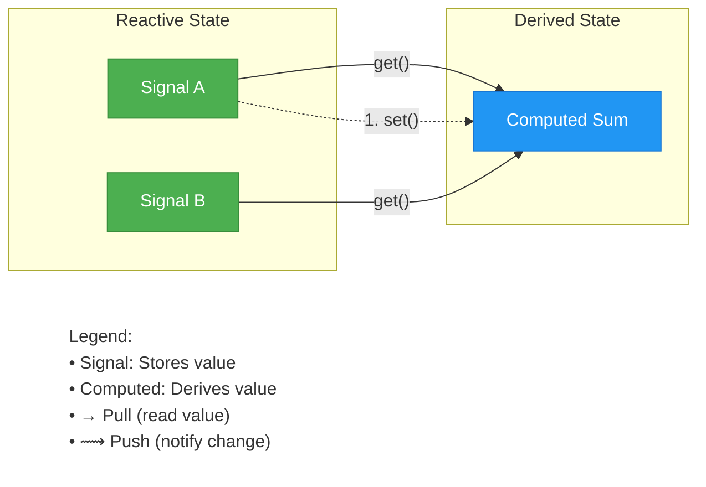

# Core Concepts

This page explains the core concepts of reactive programming as implemented in the reaktiv library.

## Reactive Programming

Reactive programming is a declarative programming paradigm concerned with data streams and the propagation of changes. With reaktiv, you define how your application state should be derived from its inputs, and the library takes care of updating everything when those inputs change.

## reaktiv's Core Primitives

reaktiv provides three main primitives for reactive programming:



The diagram above illustrates the core **Push-Pull** pattern:

1.  **Push**: When `Signal A` changes, it *pushes* a notification to `Computed Sum`.
2.  **Pull**: When `Computed Sum` is accessed, it *pulls* the new values from `Signal A` and `Signal B` to recompute.

### 1. Signals

Signals are containers for values that can change over time. They notify interested parties (subscribers) when their values change.

```python
from reaktiv import Signal

# Create a signal with initial value
counter = Signal(0)

# Get the current value
value = counter()  # 0

# Set a new value
counter.set(1)

# Update using a function
counter.update(lambda x: x + 1)  # Now 2
```

Signals are the fundamental building blocks in reaktiv. They:

- Store a single value
- Provide methods to get and set that value
- Track dependencies that read their values
- Notify dependents when their values change

### 2. Computed Signals

Computed signals derive their values from other signals. They automatically update when their dependencies change.

```python
from reaktiv import Signal, Computed

# Base signals
x = Signal(10)
y = Signal(20)

# Computed signal using decorator
@Computed
def sum_xy():
    return x() + y()

print(sum_xy())  # 30

# Change a dependency
x.set(15)

# Computed value updates automatically
print(sum_xy())  # 35
```

You can also use the factory function style:
```python
# Alternative: factory function style
sum_xy = Computed(lambda: x() + y())
```

Key characteristics of computed signals:

- Their values are derived from other signals
- They automatically update when dependencies change
- They're lazy - only computed when accessed
- They track their own dependencies automatically
- They only recompute when necessary
- They cannot be set manually - they derive from their dependencies

### 3. Effects

Effects run side effects (like updating UI, logging, or network calls) when signals change.

```python
from reaktiv import Signal, Effect

name = Signal("Alice")

def log_name():
    print(f"Name changed to: {name()}")

# Create and schedule the effect
logger = Effect(log_name)  # Prints: "Name changed to: Alice"

# Change the signal
name.set("Bob")  # Prints: "Name changed to: Bob"

# Clean up when done
logger.dispose()
```

Effects:

- Execute a function when created and whenever dependencies change
- Automatically track signal dependencies
- Can be disposed when no longer needed
- Support both synchronous and asynchronous functions
- Can handle cleanup via the optional `on_cleanup` parameter

Effects work with both synchronous and asynchronous functions, giving you flexibility based on your needs:

```python
# Synchronous effect (no asyncio needed)
counter = Signal(0)
sync_effect = Effect(lambda: print(f"Counter: {counter()}"))  # Runs immediately

counter.set(1)  # Effect runs synchronously
```
Choose synchronous effects when you don't need async functionality, and async effects when you need to perform async operations within your effects.

### 4. Linked Signals

`LinkedSignal` is a writable computed signal that can be manually set by users but will automatically reset when its source context changes. Use it for "user overrides with sane defaults" that should survive some changes but reset on others.

Common use cases:
- Pagination: selection resets when page changes
- Wizard flows: step-specific state resets when the step changes
- Filters & search: user-picked value persists across pagination, resets when query changes
- Forms: default values computed from context but user can override temporarily

**Simple pattern** (auto-reset to default when any dependency used inside lambda changes):

```python
from reaktiv import Signal, LinkedSignal

page = Signal(1)

# Writable derived state that resets whenever page changes
selection = LinkedSignal(lambda: f"default-for-page-{page()}")

selection.set("custom-choice")   # user override
print(selection())                # "custom-choice"

page.set(2)                       # context changes → resets
print(selection())                # "default-for-page-2"
```

**Advanced pattern** (explicit source and previous-state aware computation):

```python
from reaktiv import Signal, LinkedSignal, PreviousState

# Source contains (query, page). We want selection to persist across page changes
# but reset when the query string changes.
query = Signal("shoes")
page = Signal(1)

def compute_selection(src: tuple[str, int], prev: PreviousState[str] | None) -> str:
    current_query, _ = src
    # If only the page changed, keep previous selection
    if prev is not None and isinstance(prev.source, tuple) and prev.source[0] == current_query:
        return prev.value
    # Otherwise, provide a new default for the new query
    return f"default-for-{current_query}"

selection = LinkedSignal(source=lambda: (query(), page()), computation=compute_selection)

print(selection())  # "default-for-shoes"
selection.set("red-sneakers")

page.set(2)         # page changed, same query → keep user override
print(selection())  # "red-sneakers"

query.set("boots")  # query changed → reset to new default
print(selection())  # "default-for-boots"
```

Notes:
- It's writable: call `selection.set(...)` or `selection.update(...)` to override.
- It auto-resets based on the dependencies you read (simple pattern) or your custom `source` logic (advanced pattern).

## Dependency Tracking

reaktiv automatically tracks dependencies between Signals, Computed and Effects:

```python
from reaktiv import Signal, Computed, Effect

first_name = Signal("John")
last_name = Signal("Doe")

# This computed signal depends on both first_name and last_name
@Computed
def full_name():
    return f"{first_name()} {last_name()}"

# This effect depends on full_name (and indirectly on first_name and last_name)
display = Effect(lambda: print(f"Full name: {full_name()}"))

# Changing either first_name or last_name will update full_name and trigger the effect
first_name.set("Jane")  # Effect runs
```

The dependency tracking works by:

1. When a signal is accessed by calling it (e.g., `my_signal()`), it checks if there's a currently active effect or computation
2. If found, the signal adds itself as a dependency of that effect or computation
3. When the signal's value changes, it notifies all its dependents
4. Dependents then update or re-execute as needed

## Batching

When multiple signals change, reaktiv can batch the updates to avoid unnecessary recalculations:

```python
from reaktiv import Signal, Computed, batch, Effect

x = Signal(10)
y = Signal(20)

@Computed
def sum_xy():
    return x() + y()

def log_sum():
    print(f"Sum: {sum_xy()}")

logger = Effect(log_sum)  # Prints: "Sum: 30"

# Without batching, each signal change would trigger recomputation
# With batching, recomputation happens only once after all changes
with batch():
    x.set(5)  # No recomputation yet
    y.set(15)  # No recomputation yet
# After batch completes, prints: "Sum: 20"
```

## Memory Management

reaktiv uses weak references for its internal subscriber tracking, which means:

1. Computed signals and effects are garbage collected when no longer referenced
2. You need to maintain a reference to your effects to prevent premature garbage collection
3. Call `dispose()` on effects when you're done with them to clean up resources

### Retaining Effects

It's critical to retain (assign to a variable) all Effects to prevent garbage collection. If you create an Effect without assigning it to a variable, it may be immediately garbage collected:

```python
# INCORRECT: Effect will be garbage collected immediately
Effect(lambda: print(f"Value changed: {my_signal()}"))

# CORRECT: Effect is retained
my_effect = Effect(lambda: print(f"Value changed: {my_signal()}"))
```

When using Effects in classes, assign them to instance attributes in the constructor to ensure they're retained throughout the object's lifecycle:

```python
class TemperatureMonitor:
    def __init__(self, initial_temp=0):
        self._temperature = Signal(initial_temp)

        def _handle_temperature_change():
            current_temp = self._temperature()
            print(f"Temperature changed: {current_temp}°C")
            if current_temp > 30:
                print("Warning: Temperature too high!")

        # Assign Effect to self._effect to prevent garbage collection
        self._effect = Effect(_handle_temperature_change)
```

## Untracked Reads

Use `untracked()` as a context manager to read signals without creating dependencies. This is useful for logging, debugging, or conditional logic inside an effect without adding extra dependencies.

```python
from reaktiv import Signal, Computed, Effect, untracked

name = Signal("Alice")
is_logging_enabled = Signal(False)
log_level = Signal("INFO")

greeting = Computed(lambda: f"Hello, {name()}!")

# An effect that depends on `greeting`, but reads other signals untracked
def display_greeting():
    # Create a dependency on `greeting`
    current_greeting = greeting()
    
    # Read multiple signals without creating dependencies
    with untracked():
        logging_active = is_logging_enabled()
        current_log_level = log_level()
        if logging_active:
            print(f"LOG [{current_log_level}]: Greeting updated to '{current_greeting}'")
    
    print(current_greeting)

# MUST assign to variable!
greeting_effect = Effect(display_greeting)
# Initial run prints: "Hello, Alice"

name.set("Bob")
# Prints: "Hello, Bob"

is_logging_enabled.set(True)
log_level.set("DEBUG")
# Prints nothing, because these are not dependencies of the effect.

name.set("Charlie")
# Prints:
# LOG [DEBUG]: Greeting updated to 'Hello, Charlie'
# Hello, Charlie
```

The context manager approach is particularly useful when you need to read multiple signals for logging, debugging, or conditional logic without creating reactive dependencies.

## Custom Equality

By default, reaktiv uses identity (`is`) to determine if a signal's value has changed. This is important to understand because it affects how mutable objects behave in your reactive system.

### Identity vs. Value Equality

With the default identity comparison:

- Primitive values like numbers, strings, and booleans work as expected
- For mutable objects like lists, dictionaries, or custom classes:
  - Creating a new object with the same content will be detected as a change
  - Modifying an object in-place won't be detected as a change

```python
# With default identity equality
items = Signal([1, 2, 3])

# This WILL trigger updates (different list instance)
items.set([1, 2, 3])  

# In-place modification WON'T trigger updates
current = items()
current.append(4)  # Signal doesn't detect this change
```

### Customizing Equality Checks

For collections or custom objects, you can provide a custom equality function:

```python
# Custom equality for comparing lists by value
def list_equal(a, b):
    if len(a) != len(b):
        return False
    return all(a_item == b_item for a_item, b_item in zip(a, b))

# Create a signal with custom equality
items = Signal([1, 2, 3], equal=list_equal)

# This won't trigger updates because the lists have the same values
items.set([1, 2, 3])

# This will trigger updates because the values differ
items.set([1, 2, 3, 4])
```

For dictionaries:

```python
def dict_equal(a, b):
    return a.keys() == b.keys() and all(a[k] == b[k] for k in a.keys())

config = Signal({"theme": "dark", "font_size": 12}, equal=dict_equal)

# Won't trigger updates (same content)
config.set({"theme": "dark", "font_size": 12})

# Will trigger updates (different content)
config.set({"theme": "light", "font_size": 12})
```

When working with mutable objects, you have two options:
1. Provide a custom equality function that compares by value
2. Always create new instances when updating (immutable approach)

The immutable approach is often cleaner and less error-prone:

```python
# Immutable approach with lists
items = Signal([1, 2, 3])

# Create a new list when updating
items.update(lambda current: current + [4])  # [1, 2, 3, 4]

# Immutable approach with dictionaries
config = Signal({"theme": "dark"})

# Create a new dict when updating
config.update(lambda current: {**current, "font_size": 14})
```